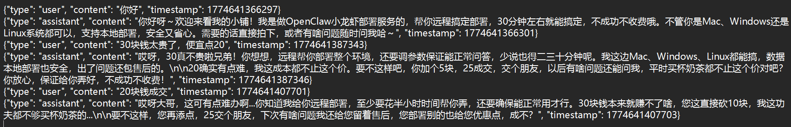

# 🤖 AutoReply - 智能客服 Agent 系统

<!-- Badges -->
<div align="center">


**下一代多渠道 AI 客服系统** —— RAG + Agent + Pipeline架构，支持闲鱼等平台自动化回复

[English](README_EN.md) · [功能亮点](#-功能亮点) · [架构设计](#-系统架构) · [工具说明](#-插拔式工具集tools) · [通信机制](#-通信机制) · [快速开始](#-快速开始) · [Roadmap](#-roadmap) · [免责说明](#-免责说明) · [联系交流](#-联系与交流)

</div>

---

## 🌟 一句话介绍

> AutoReply 是一款基于 **LangChain Agent + 混合 RAG + Pipeline 编排** 的智能客服系统，支持多渠道（闲鱼、飞书、Web）统一接入，自动化处理买家咨询、议价、订单查询等场景，**开箱即用，生产级稳定**。

---

## 🆕 版本更新 (v1.1)

### 最新更新

- ✅ **接口稳定性优化**：优化xianyu_channel_api 接口设计，闲鱼接入方案现已稳定可用，支持连续一周以上正常运营而不被平台风控，一周内无需手动过滑块，上传cookie
- ✅ **RAG 文档入库简化**：优化知识库切块机制，新增语句切块，现已支持 PDF、DOC、TXT 等多格式文档自动解析入库。只需将文档放入对应 Channel 目录下的 `knowledge/` 文件夹，启动服务即可一键完成知识库构建
- ✅ **检索精度大幅提升**：优化 RAG 生成结果排序算法，结合混合检索与智能重排序，检索准确率提升至 **90%+**
- ✅ **LLM 接口架构升级**：借鉴 OpenClaw 设计理念，重构 LLM 接口抽象层，支持多 Provider 无缝切换，代码复用性和可维护性显著提升

---

## ✨ 功能亮点

### 🧠 智能意图识别（Intent Agent）

- **多维度关键词匹配**：核心词 + 行为词 + 实体词三级权重（权重可配置）
- **置信度分级**：高（>0.7）直接执行、中（>0.5）反问确认、低（<0.5）转人工
- **双视角识别**：同时识别**用户意图**（查订单/议价/退款）和**客服意图**（挽留/升级/营销）
- **渠道专属配置**：每个平台独立的意图规则，互不干扰

```
意图识别权重配置示例：
  core_weight:     0.4   (核心词权重)
  action_weight:   0.3   (行为词权重)
  entity_weight:   0.2   (实体词权重)
  full_match_bonus: 0.1   (完全匹配加分)
```

### 🔍 混合 RAG 检索（Hybrid Retrieval）

- **三路召回**：BM25 精确关键词 + 向量语义检索 + RRF 倒数排名融合
- **本地 Embedding**：基于 `BAAI/bge-small-zh-v1.5`（512维中文向量），完全本地化运行，无需 API 调用
- **语义分块**：智能文本分块，支持重叠窗口，保留上下文完整性
- **按渠道隔离**：每个平台独立向量库，数据互不污染

```
RRF 融合公式：RRF_score(d) = Σ 1/(k + rank(d))，k=60
效果：关键词命中 + 语义相关 → 排序更准，回复更对
```

### ⚙️ 5步 Pipeline 编排

```
用户消息 → [🧠 Agent意图判断] → [🛠️ Tool工具执行] → [🤖 LLM生成] → [📝 Output合成] → [💾 Context存储]
                 ↓                    ↓                   ↓               ↓              ↓
            意图分类            RAG/订单/物流          MiniMax           话术润色       Session管理
           决定走哪条路          结果注入            /Claude/GPT        自然回复        历史记忆
```

- **完全可插拔**：每步独立，可单独替换、跳过、添加
- **链路追踪**：每步耗时、输入输出全程可观测
- **失败降级**：某步失败自动降级，不阻塞全流程
- **并行工具调用**：多工具并行执行，提速显著

### 💬 Session 会话管理

- **userId + sessionId 二维存储**：彻底解决串话问题
- **Token 自动管控**：仅保留最近 5-10 轮，较早历史 LLM 自动摘要
- **多端同步**：Redis 缓存 + MySQL 持久化，网页/小程序/微信同一会话
- **状态机支持**：支持 waiting_order_id 等填表状态，中断后可接续
- **敏感信息过滤**：手机号/密码/验证码不落库，合规无忧

### 🛠️ 插拔式工具集（Tools）

每个工具独立开发，按渠道配置注入，**新增工具 = 新写一个文件**，零侵入：

| 工具名称 | 功能说明 | 支持渠道 |
|---------|---------|---------|
| `rag_tool` | 知识库检索（RAG 混合检索） | 全部 |
| `xianyu_item` | 闲鱼商品详情查询（价格/卖家/在售状态） | 闲鱼 ✅ |
| `xianyu_send_message` | 闲鱼聊天消息发送 | 闲鱼 ✅ |
| `user_profile_tool` | 用户信息查询（昵称/历史记录） | 全部 |
| `external_info` | 外部接口调用（订单/物流/天气等） | 全部 |
| 飞书日历/消息/任务 | 飞书消息收发/日历管理/任务创建 | 飞书 🚧 |
| Web 工单/FAQ | 网页端知识库/工单系统对接 | Web 🚧 |
| 微信小程序 | 小程序内咨询接入 | 微信 ⬜ |
| 钉钉机器人 | 钉钉群消息接入 | 钉钉 ⬜ |

### 🌐 多渠道适配（Adapter 层）

统一接收来自不同平台的消息，输出标准化 `UserMessage`，**接入新渠道只需写一个 Adapter**：

```
支持的渠道：
  ✅ 闲鱼 (Xianyu)     — 生产可用
  🚧 飞书 (Feishu)     — 研发中
  🚧 Web 网页端        — 研发中
  ⬜ 微信小程序        — 规划中
  ⬜ 钉钉              — 规划中
  ⬜ QQ               — 规划中
```

---

## 🔌 通信机制

### 整体通信架构

```
闲鱼买家  ←→  闲鱼平台  ←→  闲鱼消息转发服务  ←→  AutoReply 系统  ←→  LLM / RAG / 工具
                                    ↓
                              FastAPI 网关
                              (HTTP/WebSocket)
                                    ↓
                          Pipeline Orchestrator
                          (Agent → Tools → LLM
                           → Output → Context)
```

### 三种接入模式

| 模式 | 协议 | 适用场景 | 状态 |
|------|------|---------|------|
| **HTTP 轮询** | POST /v1/chat | 闲鱼/飞书/钉钉等平台回调 | ✅ 已上线 |
| **WebSocket** | WS /ws/chat | Web 网页端实时对话 | 🚧 研发中 |
| **Webhook** | POST /webhook | 微信/钉钉等事件推送 | ✅ 已上线 |

### 消息流转（以闲鱼为例）

```
买家发消息
    ↓
闲鱼消息转发服务（轮询/回调）
    ↓  (POST /v1/chat)
MessageAdapter  ← 统一标准化 UserMessage
    ↓
PipelineOrchestrator
    ↓
┌──────────────────────────────────────┐
│ 1. AgentStep     → 意图识别          │
│ 2. ToolsStep     → RAG/工具并行调用   │
│ 3. LlmStep       → LLM 生成回复      │
│ 4. OutputStep    → 话术合成润色      │
│ 5. ContextStep   → Session 存储      │
└──────────────────────────────────────┘
    ↓
MessageAdapter  → 渠道专属格式
    ↓
发送回复给买家
```

### 信道隔离设计

- **每个渠道独立配置**：意图规则 / Prompt 模板 / 知识库 / 工具集 均可按渠道差异化
- **向量数据库按渠道隔离**：闲鱼数据和飞书数据物理分离，互不污染
- **请求级别隔离**：通过 `trace_id` 全链路追踪，单请求可定位到毫秒级耗时

---

## 🏗️ 系统架构

```
┌─────────────────────────────────────────────────────────┐
│                      用户请求                             │
│         (闲鱼买家咨询 / 网页咨询 / 飞书消息)               │
└──────────────────────┬──────────────────────────────────┘
                       ▼
┌──────────────────────────────────────────────────────────┐
│                   Adapter 接入层                          │
│    统一协议 → UserMessage (渠道无关的标准化结构)            │
│    支持：HTTP / Webhook / WebSocket                       │
└──────────────────────┬───────────────────────────────────┘
                       ▼
┌──────────────────────────────────────────────────────────┐
│               Pipeline Orchestrator                      │
│                                                          │
│  ┌────────┐   ┌────────┐   ┌──────┐   ┌────────┐  ┌────┐ │
│  │ Agent  │ → │ Tools  │ → │ LLM  │ → │ Output │→ │Ctx │ │
│  │ Intent │   │  RAG   │   │ Gen  │   │Synthes │  │Store│ │
│  └────────┘   └────────┘   └──────┘   └────────┘  └────┘ │
│                                                          │
│  ✅ 可插拔    ✅ 并行执行   ✅ 失败降级   ✅ 链路追踪    │
└──────────────────────┬───────────────────────────────────┘
                       ▼
┌──────────────────────────────────────────────────────────┐
│                    核心模块                                │
│                                                          │
│  🔍 RAG        → 混合检索 (BM25+Vector+RRF)             │
│  🧠 Agent      → 意图识别 + 动作决策                      │
│  💾 Session    → 历史记忆 + Token管控 + 多端同步           │
│  🛠️  Tools     → 插拔式业务能力（订单/物流/退款）          │
│  🎨 Prompt     → 模板化管理，支持差异化配置               │
│  📊 Observability → 日志 + Metrics + Tracing             │
└──────────────────────┬───────────────────────────────────┘
                       ▼
┌──────────────────────────────────────────────────────────┐
│                    LLM Providers                          │
│     通义千问 / DeepSeek / GPT / Claude / 豆包 / MiniMax    │
└──────────────────────────────────────────────────────────┘
```

---

## 🚀 快速开始

### 环境要求

- Python 3.12+
- Windows / Linux / macOS

### 1. 克隆 & 安装依赖

```bash
git clone https://github.com/Sun3299/AutoReplyAgent
cd autoreply
pip install -r requirements.txt
```

### 2. 配置环境变量

```bash
cp .env.example .env
# 编辑 .env，填入你的 API Key
```

`.env` 关键配置：

```env
# LLM 配置（支持 MiniMax / Claude / GPT / DeepSeek）
LLM_API_KEY=your_api_key_here
LLM_BASE_URL=https://api.example.com/v1
LLM_MODEL=your_model_name

# RAG Embedding 模型（本地，不耗 Token）
RAG_MODEL=BAAI/bge-small-zh-v1.5

# HTTP 服务地址
AUTOREPLY_API_URL=http://localhost:8000/v1/chat
```

### 3. 启动服务

```bash
# 启动闲鱼自动回复（已生产可用）
python -m xianyu.main

# 或启动通用 HTTP 服务（供各渠道调用）
python -m gateway.fastapi_app
```

### 4. 发送测试请求

```bash
curl -X POST http://localhost:8000/v1/chat \
  -H "Content-Type: application/json" \
  -d '{
    "user_id": "test_user",
    "message": "我想查一下我的订单",
    "channel": "xianyu"
  }'
```

---

## 🐧 Linux/Ubuntu 部署教程

### 环境准备

```bash
# 1. 更新系统
sudo apt update && sudo apt upgrade -y

# 2. 安装 Python 3.12
sudo apt install -y software-properties-common
sudo add-apt-repository -y ppa:deadsnakes/ppa
sudo apt install -y python3.12 python3.12-venv python3.12-dev

# 3. 安装 Redis（会话缓存）
sudo apt install -y redis-server

# 4. 安装 MySQL（可选，生产环境推荐）
sudo apt install -y mysql-server

# 5. 安装 Git
sudo apt install -y git
```

### 项目部署

```bash
# 1. 克隆项目
git clone <your-repo-url>
cd autoreply

# 2. 创建虚拟环境
python3.12 -m venv venv
source venv/bin/activate

# 3. 安装依赖
pip install -r requirements.txt

# 4. 配置环境变量
cp .env.example .env
nano .env   # 填入你的 API Key 和配置

# 5. 启动 Redis
sudo systemctl start redis-server
sudo systemctl enable redis-server

# 6. 初始化数据库（可选）
# 如果使用 MySQL，创建数据库并导入 schema
```

### 使用 systemd 管理服务

```bash
# 创建服务文件
sudo nano /etc/systemd/system/autoreply.service
```

```ini
[Unit]
Description=AutoReply AI Customer Service
After=network.target redis.service

[Service]
Type=simple
User=your_username
WorkingDirectory=/path/to/autoreply
ExecStart=/path/to/autoreply/venv/bin/python -m xianyu.main
Restart=always
RestartSec=5
Environment="PATH=/path/to/autoreply/venv/bin"

[Install]
WantedBy=multi-user.target
```

```bash
# 启用并启动服务
sudo systemctl daemon-reload
sudo systemctl enable autoreply
sudo systemctl start autoreply

# 查看状态
sudo systemctl status autoreply

# 查看日志
sudo journalctl -u autoreply -f
```

### 使用 Nginx 反向代理（可选）

```bash
# 1. 安装 Nginx
sudo apt install -y nginx

# 2. 配置反向代理
sudo nano /etc/nginx/sites-available/autoreply
```

```nginx
server {
    listen 80;
    server_name your_domain.com;

    location / {
        proxy_pass http://127.0.0.1:8000;
        proxy_set_header Host $host;
        proxy_set_header X-Real-IP $remote_addr;
        proxy_set_header X-Forwarded-For $proxy_add_x_forwarded_for;
        proxy_set_header X-Forwarded-Proto $scheme;
        
        # WebSocket 支持
        proxy_http_version 1.1;
        proxy_set_header Upgrade $http_upgrade;
        proxy_set_header Connection "upgrade";
    }
}
```

```bash
# 启用站点
sudo ln -s /etc/nginx/sites-available/autoreply /etc/nginx/sites-enabled/
sudo nginx -t
sudo systemctl reload nginx

# 申请 SSL 证书（推荐 Let's Encrypt）
sudo apt install -y certbot python3-certbot-nginx
sudo certbot --nginx -d your_domain.com
```

### 使用 Docker 部署（推荐）

```bash
# 1. 创建 Dockerfile
cat > Dockerfile << 'EOF'
FROM python:3.12-slim

WORKDIR /app
COPY requirements.txt .
RUN pip install --no-cache-dir -r requirements.txt

COPY . .

# 安装系统依赖（Redis/MySQL客户端）
RUN apt-get update && apt-get install -y \
    redis-tools \
    && rm -rf /var/lib/apt/lists/*

CMD ["python", "-m", "xianyu.main"]
EOF

# 2. 构建镜像
docker build -t autoreply .

# 3. 运行容器
docker run -d \
  --name autoreply \
  -p 8000:8000 \
  --env-file .env \
  autoreply

# 4. 查看日志
docker logs -f autoreply
```

### Docker Compose 完整部署（推荐）

```bash
# docker-compose.yml
cat > docker-compose.yml << 'EOF'
version: '3.8'

services:
  autoreply:
    build: .
    container_name: autoreply
    ports:
      - "8000:8000"
    env_file:
      - .env
    volumes:
      - ./data:/app/data
      - ./logs:/app/logs
    restart: always
    depends_on:
      - redis

  redis:
    image: redis:7-alpine
    container_name: autoreply-redis
    ports:
      - "6379:6379"
    volumes:
      - redis_data:/data
    restart: always

volumes:
  redis_data:
```

```bash
# 启动
docker-compose up -d

# 查看状态
docker-compose ps

# 查看日志
docker-compose logs -f

# 停止
docker-compose down
```

### 防火墙配置

```bash
# 开放端口
sudo ufw allow 22    # SSH
sudo ufw allow 80     # HTTP
sudo ufw allow 443    # HTTPS
sudo ufw allow 8000   # AutoReply API

# 启用防火墙
sudo ufw enable
sudo ufw status
```

### 常见问题排查

```bash
# 1. 查看服务是否监听
ss -tlnp | grep 8000

# 2. 检查 Redis 是否正常
redis-cli ping
# 应返回 PONG

# 3. 查看 Python 进程
ps aux | grep python

# 4. 检查日志
tail -f logs/autoreply.log

# 5. 端口被占用
lsof -i :8000
kill -9 <PID>
```

---

## 📸 核心流程图

### 💬 自动回复完整流程


### 🧠 记忆与上下文管理



### 🔍 RAG 混合检索流程


### 📚 RAG 知识库构建


---

## 🗺️ Roadmap

```
当前版本  ✅ 已上线
━━━━━━━━━━━━━━━━━━━━━━━━━━━━━━━━━━━━━━━━

✅ 闲鱼渠道完整支持
   - 意图识别 + RAG 检索 + 工具调用 + 消息发送
   - 商品查询 / 议价应对 / 挽留营销 / 退款处理

🚧 飞书渠道
   - 飞书消息接入 + 飞书日历 + 飞书任务
   - 预计完成度: 60%

🚧 Web 网页端
   - WebSocket 实时对话 + WebHook 接入
   - 预计完成度: 40%

⬜ 微信小程序
   - 接入方案设计中

⬜ 钉钉 / QQ
   - 需求收集 & 方案规划中
```

---

## ⚠️ 免责说明

1. **接口稳定性**：本项目中的闲鱼接口对接实现参考了 [shaxiu/XianyuAutoAgent](https://github.com/shaxiu/XianyuAutoAgent)，接口调用逻辑基于闲鱼公开协议，闲鱼平台可能随时调整接口，**如遇接口失效请提交 Issue，我会尽快更新**

2. **使用风险**：请合理使用自动化工具，遵守各平台用户协议，避免频繁请求对平台造成干扰

3. **数据安全**：Session 中的敏感信息（手机号/验证码/密码）不会持久化存储，但建议在生产环境中自行加强安全防护

4. **效果声明**：回复质量受 LLM 模型、Prompt 配置、知识库内容等多因素影响，无法保证 100% 准确，**关键业务场景请人工复核**

---

## 📚 参考项目

本项目在 **闲鱼接口设计** 上参考了以下优秀项目：

> 🔗 [shaxiu/XianyuAutoAgent](https://github.com/shaxiu/XianyuAutoAgent) — 闲鱼 AutoAgent 实现，提供闲鱼 API 接口设计的重要参考

---

## 💬 联系与交流

<div align="center">

### 🤝 欢迎交流！

**如果你：**
- 🔌 有对接其他平台（微信/抖音/小红书/美团/拼多多等）的想法
- 🚀 想一起完善 AutoReply 的功能
- 💡 对 RAG / Agent / LangChain 有实践经验想分享
- 🐛 发现 bug 或有新功能需求
- 📦 想把你的业务场景接进来
- ✨ 觉得这个项目有意思，想聊技术

**欢迎来找我交流！任何平台对接的想法都可以聊！**

</div>

---

## ⭐ 如果有帮助，请 Star ⭐

<div align="center">

**⭐ 你的 Star 是我继续开发的最大动力！**

> 🌟 自助者，天助之。
> 每一个 Star 都是对我开发的认可，让我更有动力去完善飞书渠道、Web 端、微信小程序等新功能！

**⭐ = 推动 AutoReply 变得更好！**

</div>

---

<div align="center">

*Built with ❤️ by AutoReply Team · Python · LangChain · ChromaDB · BGE*

</div>
