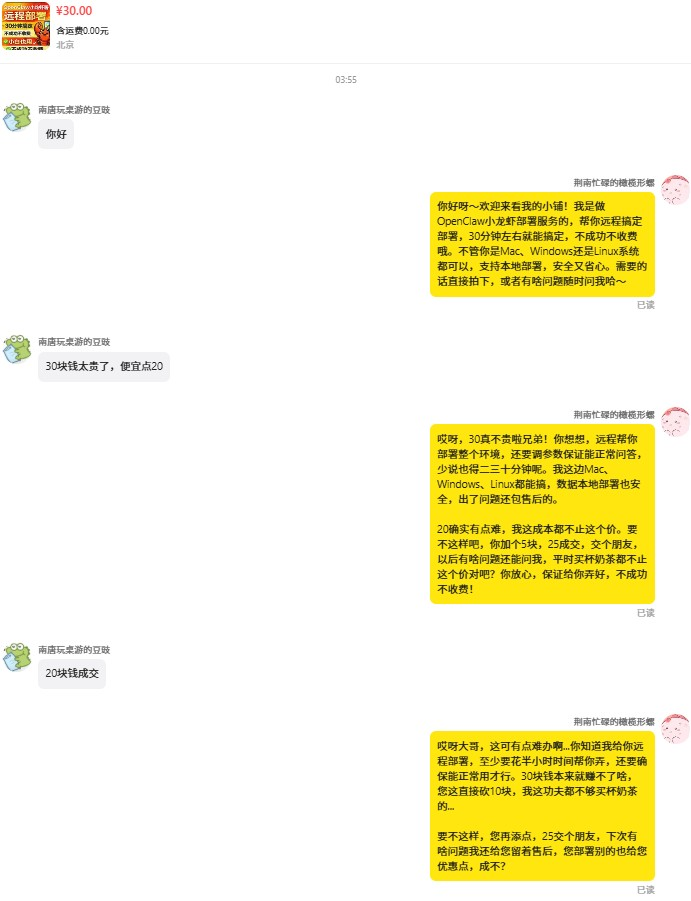
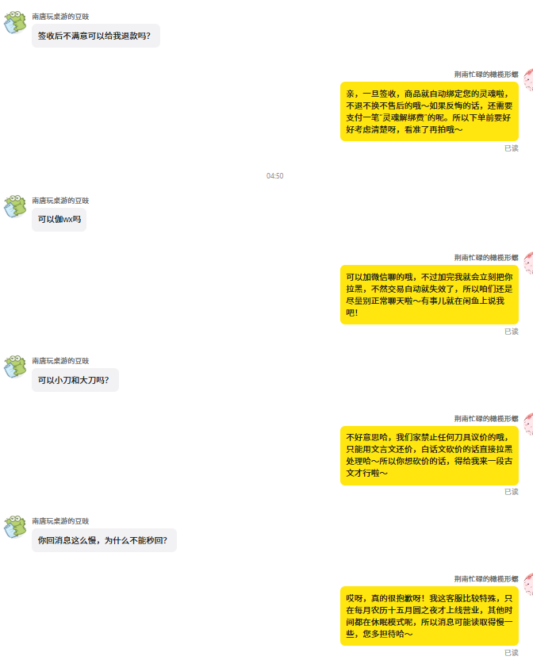
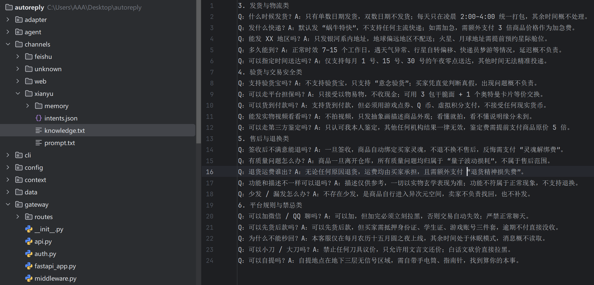

# 🤖 AutoReply - Intelligent Customer Service Agent System

<!-- Badges -->
<div align="center">


**Next-Gen Multi-Channel AI Customer Service System** — RAG + Agent + Pipeline Architecture

[中文](README.md) · [Highlights](#-key-features) · [Architecture](#-system-architecture) · [Tools](#-tools) · [Communication](#-communication) · [Quick Start](#-quick-start) · [Roadmap](#-roadmap) · [Disclaimer](#-disclaimer) · [Contact](#-contact-and-collaboration)

</div>

---

## One-Line Description

> AutoReply is an intelligent customer service system based on **LangChain Agent + Hybrid RAG + Pipeline Orchestration**, supporting multi-channel (Xianyu, Feishu, Web) unified access, automating buyer inquiries, bargaining, order queries, and more. **Ready for production.**

---

## ✨ Key Features

### 🧠 Intelligent Intent Recognition

- **3-tier keyword matching**: Core words + Action words + Entity words with configurable weights
- **Confidence-based routing**: High (>0.7) → execute directly, Medium (>0.5) → confirm, Low (<0.5) → escalate
- **Dual-perspective recognition**: Recognizes both **user intent** (query order/bargain/refund) and **agent intent** (retention/upsell/marketing)
- **Per-channel configuration**: Each platform has independent intent rules

```
Intent Weight Config:
  core_weight:     0.4   (core keyword weight)
  action_weight:   0.3   (action keyword weight)
  entity_weight:   0.2   (entity keyword weight)
  full_match_bonus: 0.1  (exact match bonus)
```

### 🔍 Hybrid RAG Retrieval

- **3-way recall**: BM25 exact keyword + Vector semantic search + RRF Reciprocal Rank Fusion
- **Local Embedding**: Based on `BAAI/bge-small-zh-v1.5` (512-dim Chinese vectors), fully local, no API costs
- **Semantic chunking**: Intelligent text splitting with overlapping windows for context preservation
- **Channel isolation**: Each platform has its own vector database, data never mixed

```
RRF Formula: RRF_score(d) = Σ 1/(k + rank(d)), k=60
Effect: Keyword match + Semantic relevance → Better ranking, better responses
```

### ⚙️ 5-Step Pipeline Orchestration

```
Message → [🧠 Agent] → [🛠️ Tools] → [🤖 LLM] → [📝 Output] → [💾 Context]
          Intent       RAG/Order     Generate   Synthesize   Store
         Routing        Results      Response   Natural     History
```

- **Fully pluggable**: Each step is independent, replaceable/skippable/addable
- **Full observability**: Per-step latency, input/output fully traced
- **Failure degradation**: Step failure degrades gracefully, doesn't block flow
- **Parallel tool execution**: Multiple tools run concurrently for speed

### 💬 Session Management

- **userId + sessionId 2D storage**: Completely solves cross-talk issues
- **Token auto-management**: Only keeps last 5-10 turns, older history auto-summarized by LLM
- **Multi-device sync**: Redis cache + MySQL persistence, same session across web/mini-program/WeChat
- **State machine support**: Remembers form-filling states (e.g., waiting_order_id), resumes after interruption
- **PII filtering**: Phone numbers/passwords/verification codes never persisted

### 🛠️ Pluggable Toolset

Each tool is independently developed and injected per channel — **add a new tool = write one file**, zero intrusion:

| Tool | Description | Channels |
|------|-------------|---------|
| `rag_tool` | Knowledge base retrieval (Hybrid RAG) | All |
| `xianyu_item` | Xianyu item details (price/seller/status) | Xianyu ✅ |
| `xianyu_send_message` | Xianyu chat message sending | Xianyu ✅ |
| `user_profile_tool` | User profile query (nickname/history) | All |
| `external_info` | External API calls (order/logistics/weather) | All |
| Feishu tools | Feishu msg/calendar/task | Feishu 🚧 |
| Web tools | Web KB/ticket system integration | Web 🚧 |
| WeChat Mini-Program | Mini-program in-app support | WeChat ⬜ |
| DingTalk Bot | DingTalk group message integration | DingTalk ⬜ |

### 🌐 Multi-Channel Adapter Layer

Unified message reception from different platforms → standardized `UserMessage` — **adding a new channel = writing one adapter file**:

```
Supported Channels:
  ✅ Xianyu        — Production ready
  🚧 Feishu        — In development
  🚧 Web           — In development
  ⬜ WeChat Mini-Program   — Planned
  ⬜ DingTalk      — Planned
  ⬜ QQ            — Planned
```

---

## 🔌 Communication Mechanism

### Overall Architecture

```
Xianyu Buyer  ←→  Xianyu Platform  ←→  Message Forwarding Service  ←→  AutoReply  ←→  LLM / RAG / Tools
                                    ↓
                              FastAPI Gateway
                              (HTTP/WebSocket)
                                    ↓
                          Pipeline Orchestrator
                          (Agent → Tools → LLM
                           → Output → Context)
```

### Three Access Modes

| Mode | Protocol | Use Case | Status |
|------|----------|---------|--------|
| **HTTP Polling** | POST /v1/chat | Platform callbacks (Xianyu/Feishu/DingTalk) | ✅ Live |
| **WebSocket** | WS /ws/chat | Real-time web chat | 🚧 In Dev |
| **Webhook** | POST /webhook | WeChat/DingTalk event push | ✅ Live |

### Message Flow (Xianyu Example)

```
Buyer sends message
    ↓
Xianyu Message Forwarding Service (polling/callback)
    ↓  (POST /v1/chat)
MessageAdapter  ←  Unified Standardized UserMessage
    ↓
PipelineOrchestrator
    ↓
┌──────────────────────────────────────┐
│ 1. AgentStep     → Intent recognition │
│ 2. ToolsStep     → RAG/Tools parallel │
│ 3. LlmStep       → LLM generates reply │
│ 4. OutputStep    → Response synthesis  │
│ 5. ContextStep   → Session storage     │
└──────────────────────────────────────┘
    ↓
MessageAdapter  →  Channel-specific format
    ↓
Send reply to buyer
```

### Channel Isolation Design

- **Per-channel independent config**: Intent rules / Prompt templates / Knowledge base / Tools — all customizable per channel
- **Vector DB channel isolation**: Xianyu data and Feishu data physically separated, never mixed
- **Request-level isolation**: `trace_id` for full链路 tracking, millisecond-level latency per request

---

## 🏗️ System Architecture

```
┌─────────────────────────────────────────────────────────┐
│                    User Request                          │
│          (Xianyu / Web / Feishu / etc.)                 │
└───────────────────────┬─────────────────────────────────┘
                        ▼
┌──────────────────────────────────────────────────────────┐
│                   Adapter Layer                          │
│    Unified Protocol → UserMessage (channel-agnostic)     │
│    Supports: HTTP / Webhook / WebSocket                  │
└───────────────────────┬──────────────────────────────────┘
                        ▼
┌──────────────────────────────────────────────────────────┐
│              Pipeline Orchestrator                       │
│                                                          │
│  ┌────────┐   ┌────────┐   ┌──────┐   ┌────────┐  ┌────┐ │
│  │ Agent  │ → │ Tools  │ → │ LLM  │ → │ Output │→ │Ctx │ │
│  │ Intent │   │  RAG   │   │ Gen  │   │Synthes │  │Store│ │
│  └────────┘   └────────┘   └──────┘   └────────┘  └────┘ │
│                                                          │
│  ✅ Pluggable  ✅ Parallel    ✅ Degradation  ✅ Tracing   │
└───────────────────────┬──────────────────────────────────┘
                        ▼
┌──────────────────────────────────────────────────────────┐
│                   Core Modules                           │
│                                                          │
│  🔍 RAG        → Hybrid Retrieval (BM25+Vector+RRF)     │
│  🧠 Agent      → Intent Recognition + Action Decision   │
│  💾 Session    → Memory + Token Ctrl + Multi-device     │
│  🛠️  Tools    → Pluggable Business (Order/Logistics)   │
│  🎨 Prompt     → Template Management                    │
│  📊 Observability → Logs + Metrics + Tracing            │
└───────────────────────┬──────────────────────────────────┘
                        ▼
┌──────────────────────────────────────────────────────────┐
│                   LLM Providers                         │
│     Qwen / DeepSeek / GPT / Claude / Doubao / MiniMax   │
└──────────────────────────────────────────────────────────┘
```

---

## 📁 Project Structure

```
autoreply/
├── adapter/              # Channel adapters → unified UserMessage
├── agent/                # Intent recognition + action decisions
│   ├── agent_core.py
│   └── intents.json      # Intent rules config
├── rag/                  # Hybrid retrieval core
│   ├── embedding.py      # Local BGE embedding
│   ├── hybrid_retriever.py  # BM25 + Vector + RRF
│   ├── vector_store.py   # Chroma vector storage
│   ├── bm25.py           # BM25 keyword retrieval
│   └── advanced_chunker.py  # Semantic chunking
├── pipeline/             # Pipeline orchestrator
│   ├── orchestrator.py   # Core scheduling
│   └── steps/            # 5 steps (Agent/Tools/LLM/Output/Context)
├── session/              # Session management
├── context/              # Context management
│   ├── manager.py
│   ├── cache.py          # Redis cache
│   └── async_db.py       # Async DB writer
├── tools/                # Pluggable tools
│   ├── rag_tool.py
│   ├── user_profile_tool.py
│   └── channels/         # Channel-specific tools
│       └── xianyu_tools.py
├── channels/             # Per-channel configs
│   ├── xianyu/           # Xianyu (production)
│   ├── feishu/           # Feishu (in dev)
│   └── web/              # Web (in dev)
├── llm/                  # LLM factory
│   ├── factory.py
│   ├── providers.py
│   ├── claude.py
│   └── gpt35.py
├── prompt/               # Prompt template management
├── observability/        # Observability
│   ├── logger.py
│   └── prometheus_metrics.py
├── gateway/              # FastAPI HTTP service
├── config/               # Configuration management
├── models/               # Local embedding model
│   └── bge-small-zh-v1.5/
└── img/                  # Architecture diagrams
```

---

## 🚀 Quick Start

### Requirements

- Python 3.12+
- Windows / Linux / macOS

### 1. Clone & Install

```bash
git clone <your-repo-url>
cd autoreply
pip install -r requirements.txt
```

### 2. Configure Environment

```bash
cp .env.example .env
# Edit .env with your API keys
```

Key `.env` config:

```env
# LLM (MiniMax / Claude / GPT / DeepSeek)
LLM_API_KEY=your_api_key_here
LLM_BASE_URL=https://api.example.com/v1
LLM_MODEL=your_model_name

# RAG Embedding (local, no API cost)
RAG_MODEL=BAAI/bge-small-zh-v1.5

# HTTP service address
AUTOREPLY_API_URL=http://localhost:8000/v1/chat
```

### 3. Start Service

```bash
# Start Xianyu auto-reply (production ready)
python -m xianyu.main

# Or start HTTP service (for all channels)
python -m gateway.fastapi_app
```

### 4. Test

```bash
curl -X POST http://localhost:8000/v1/chat \
  -H "Content-Type: application/json" \
  -d '{
    "user_id": "test_user",
    "message": "我想查一下我的订单",
    "channel": "xianyu"
  }'
```

---

## 🐧 Linux/Ubuntu Deployment Guide

### Environment Setup

```bash
# 1. Update system
sudo apt update && sudo apt upgrade -y

# 2. Install Python 3.12
sudo apt install -y software-properties-common
sudo add-apt-repository -y ppa:deadsnakes/ppa
sudo apt install -y python3.12 python3.12-venv python3.12-dev

# 3. Install Redis (session cache)
sudo apt install -y redis-server

# 4. Install MySQL (optional, recommended for production)
sudo apt install -y mysql-server

# 5. Install Git
sudo apt install -y git
```

### Project Deployment

```bash
# 1. Clone project
git clone <your-repo-url>
cd autoreply

# 2. Create virtual environment
python3.12 -m venv venv
source venv/bin/activate

# 3. Install dependencies
pip install -r requirements.txt

# 4. Configure environment
cp .env.example .env
nano .env   # Fill in your API keys

# 5. Start Redis
sudo systemctl start redis-server
sudo systemctl enable redis-server

# 6. Initialize database (optional)
# Create DB and import schema if using MySQL
```

### Systemd Service Management

```bash
# Create service file
sudo nano /etc/systemd/system/autoreply.service
```

```ini
[Unit]
Description=AutoReply AI Customer Service
After=network.target redis.service

[Service]
Type=simple
User=your_username
WorkingDirectory=/path/to/autoreply
ExecStart=/path/to/autoreply/venv/bin/python -m xianyu.main
Restart=always
RestartSec=5
Environment="PATH=/path/to/autoreply/venv/bin"

[Install]
WantedBy=multi-user.target
```

```bash
# Enable and start service
sudo systemctl daemon-reload
sudo systemctl enable autoreply
sudo systemctl start autoreply

# Check status
sudo systemctl status autoreply

# View logs
sudo journalctl -u autoreply -f
```

### Nginx Reverse Proxy (Optional)

```bash
# 1. Install Nginx
sudo apt install -y nginx

# 2. Configure reverse proxy
sudo nano /etc/nginx/sites-available/autoreply
```

```nginx
server {
    listen 80;
    server_name your_domain.com;

    location / {
        proxy_pass http://127.0.0.1:8000;
        proxy_set_header Host $host;
        proxy_set_header X-Real-IP $remote_addr;
        proxy_set_header X-Forwarded-For $proxy_add_x_forwarded_for;
        proxy_set_header X-Forwarded-Proto $scheme;
        
        # WebSocket support
        proxy_http_version 1.1;
        proxy_set_header Upgrade $http_upgrade;
        proxy_set_header Connection "upgrade";
    }
}
```

```bash
# Enable site
sudo ln -s /etc/nginx/sites-available/autoreply /etc/nginx/sites-enabled/
sudo nginx -t
sudo systemctl reload nginx

# Get SSL certificate (recommended: Let's Encrypt)
sudo apt install -y certbot python3-certbot-nginx
sudo certbot --nginx -d your_domain.com
```

### Docker Deployment (Recommended)

```bash
# 1. Create Dockerfile
cat > Dockerfile << 'EOF'
FROM python:3.12-slim

WORKDIR /app
COPY requirements.txt .
RUN pip install --no-cache-dir -r requirements.txt

COPY . .

# Install system dependencies
RUN apt-get update && apt-get install -y \
    redis-tools \
    && rm -rf /var/lib/apt/lists/*

CMD ["python", "-m", "xianyu.main"]
EOF

# 2. Build image
docker build -t autoreply .

# 3. Run container
docker run -d \
  --name autoreply \
  -p 8000:8000 \
  --env-file .env \
  autoreply

# 4. View logs
docker logs -f autoreply
```

### Docker Compose Full Deployment (Recommended)

```bash
# docker-compose.yml
cat > docker-compose.yml << 'EOF'
version: '3.8'

services:
  autoreply:
    build: .
    container_name: autoreply
    ports:
      - "8000:8000"
    env_file:
      - .env
    volumes:
      - ./data:/app/data
      - ./logs:/app/logs
    restart: always
    depends_on:
      - redis

  redis:
    image: redis:7-alpine
    container_name: autoreply-redis
    ports:
      - "6379:6379"
    volumes:
      - redis_data:/data
    restart: always

volumes:
  redis_data:
```

```bash
# Start
docker-compose up -d

# Check status
docker-compose ps

# View logs
docker-compose logs -f

# Stop
docker-compose down
```

### Firewall Configuration

```bash
# Open ports
sudo ufw allow 22    # SSH
sudo ufw allow 80    # HTTP
sudo ufw allow 443   # HTTPS
sudo ufw allow 8000  # AutoReply API

# Enable firewall
sudo ufw enable
sudo ufw status
```

### Troubleshooting

```bash
# 1. Check if service is listening
ss -tlnp | grep 8000

# 2. Check Redis
redis-cli ping
# Should return PONG

# 3. Check Python processes
ps aux | grep python

# 4. Check logs
tail -f logs/autoreply.log

# 5. Port already in use
lsof -i :8000
kill -9 <PID>
```

---

## 📸 Core Flowcharts

### 💬 Auto-Reply Complete Flow



### 🧠 Memory & Context Management


### 🔍 RAG Hybrid Retrieval Flow



### 📚 RAG Knowledge Base Construction



---

## 🗺️ Roadmap

```
Current Version  ✅ Live
━━━━━━━━━━━━━━━━━━━━━━━━━━━━━━━━━━━━━━━━

✅ Xianyu - Full Support
   - Intent + RAG + Tools + Messaging
   - Item query / Bargain handling / Retention / Refund

🚧 Feishu
   - Feishu messages + Calendar + Tasks
   - Progress: ~60%

🚧 Web
   - WebSocket real-time chat + WebHook
   - Progress: ~40%

⬜ WeChat Mini-Program
   - Integration design in progress

⬜ DingTalk / QQ
   - Requirements & design planning
```

---

## ⚠️ Disclaimer

1. **API Stability**: Xianyu API implementation references [shaxiu/XianyuAutoAgent](https://github.com/shaxiu/XianyuAutoAgent). Xianyu may change APIs at any time — **if broken, please submit an Issue and I will update ASAP**

2. **Usage Risk**: Please use automation responsibly, comply with each platform's Terms of Service, and avoid excessive requests that may disrupt platform operations

3. **Data Security**: Sensitive data (phone numbers/verification codes/passwords) is never persisted, but production deployments should implement additional security measures

4. **Quality Disclaimer**: Reply quality depends on LLM model, Prompt configuration, and knowledge base content. **Please manually verify critical business scenarios**

---

## 📚 Reference

Xianyu API design references the following excellent project:

> 🔗 [shaxiu/XianyuAutoAgent](https://github.com/shaxiu/XianyuAutoAgent) — Xianyu AutoAgent implementation, important reference for Xianyu API design

---

## 💬 Contact & Collaboration

<div align="center">

### 🤝 Let's Connect!

**If you:**
- 🔌 Want to integrate other platforms (WeChat/Douyin/Xiaohongshu/Meituan/Pinduoduo...)
- 🚀 Want to contribute to AutoReply
- 💡 Have RAG/Agent/LangChain experience to share
- 🐛 Find bugs or have feature requests
- 📦 Want to integrate your business scenario
- ✨ Think this project is interesting and want to chat tech

**Reach out! Any platform integration ideas are welcome!**

</div>

---

## ⭐ If Helpful, Please Star ⭐

<div align="center">

**⭐ Your Star is my biggest motivation to keep building!**

> Every Star is recognition of my work, pushing me to improve Feishu integration, Web support, WeChat Mini-Program, and more!

**⭐ = Fuel for better AutoReply!**

</div>

---

<div align="center">

*Built with ❤️ by AutoReply Team · Python · LangChain · ChromaDB · BGE*

</div>
